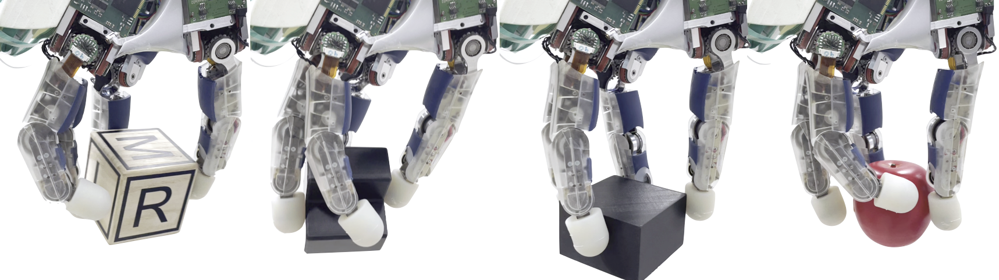
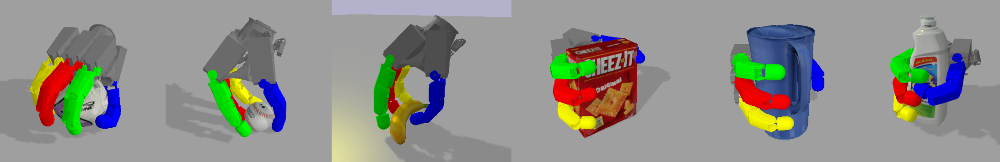
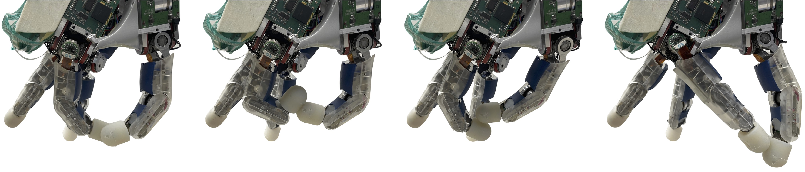

Our group aims to use modern machine-learning approaches to extend the state of the art of robotics and bring human-level autonomy and dexterity to Agile Justin. 

## In-Hand Manipluation
{:.this style="width: 1000px"}
[more information](https://dlr-alr.github.io/dlr-tactile-manipulation/)

## Grasping
{:.this style="width: 1000px"}
[more information](https://dlr-alr.github.io/grasping)

## Motion Planning
{:.this style="width: 1000px"}
Fast and efficient motion planning in unknown environments is the basis for combining Agile Justin's individual skills to solve challenging tasks autonomously. 
* Supervised learning of optimal motions in unknown, challenging environments to speed up optimization-based motion planning ([more information](https://dlr-alr.github.io/2022-iros-planning/))
* Unsupervised learning of solutions to the ambiguous IK problem while tackling the different modes with a twin-head architecture ([more information](https://dlr-alr.github.io/2023-humanoids-ik/))

## Calibration
{:.this style="width: 1000px"}
An accurate model of the whole robot is crucial to perform dextrous manipulation and grasping.
We developed self-contained calibration routines from the elastic rope mechanism in the torso to the fingertips of the torque-controlled DLR-Hand II. 
* Calibration of an elastic robot model for a humanoid and its efficient compensation for motion planning ([more information](https://dlr-alr.github.io/dlr-elastic-calibration/))
* Self-contained calibration using the internal camera while maintaining high accuracy in the cartesian workspace ([more information](https://dlr-alr.github.io/2022-humanoids-calibration/))
* Calibration of a four-fingered hand using only pairwise self-contact ([more information](https://dlr-alr.github.io/2023-humanoids-contact/))