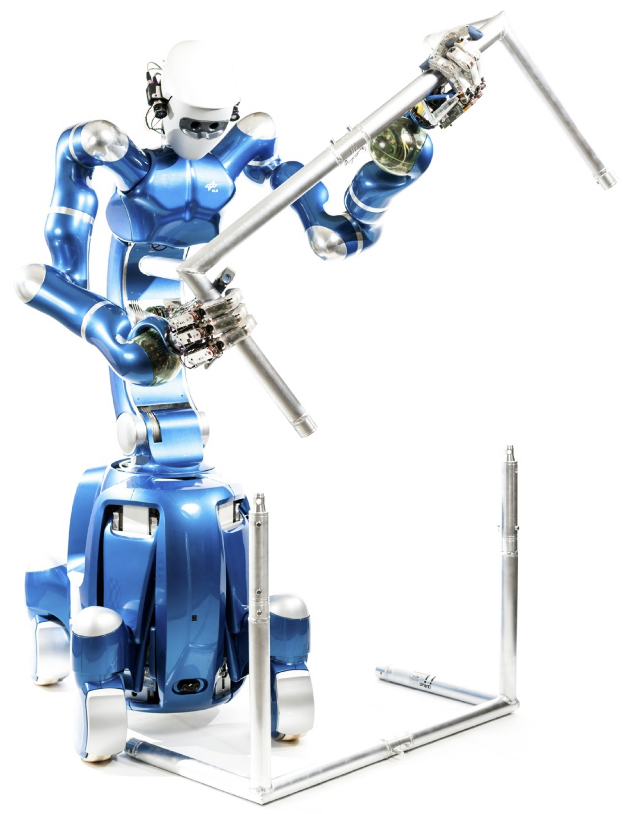

{:.this style="width: 500px"}

While the methods of our group aim to be general and easy to apply to various robotic systems, the benchmark for validating and testing on actual hardware is Agile Justin.
DLR’s humanoid Agile Justin is an advanced mechatronic system. 
It drives on four wheels and has an upper body with a rope mechanism and a passive joint to redirect torques and keep the chest upright. 
Justin has two arms. Each consists of an LWR III arm with 7 degrees of freedom (DoF) and a DLR-Hand II (12 DoF), 
which enables it to perform a wide range of dextrous manipulation tasks. 
In its actuated head is a Kinect camera with RGB and depth sensors, which the robot uses to model its environment.
Those self-acquired high-resolution voxel models are the basis for collision-free motion planning of the humanoid.
